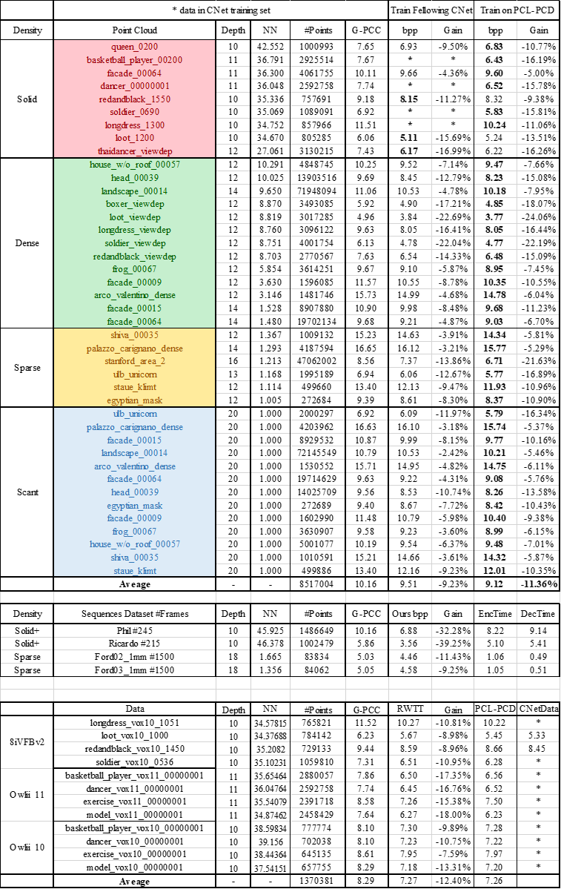

### DALD-PCAC: Density-Adaptive Learning Descriptor for Point Cloud Lossless Attribute Compression (TOMM 26)
## Install
cuda 11.7 + linux + python 37

```
pip install torch==1.13.0+cu117 torchvision==0.14.0+cu117 torchaudio==0.13.0 --extra-index-url https://download.pytorch.org/whl/cu117
pip install plyfile==0.8 h5py open3d termcolor torchac tensorboard
```

## Dataset 
Download data and copy them into ```Data```.
```
Data/
├── semanticKITTI/dataset/
│   └── sequences
|      ├── 00/velodyne/*.bin
|      ├── 01
|      └── ...
├── Ford
│   ├── Ford_01_q1mm/*.ply
│   ├── Ford_02_q1mm
│   └── Ford_03_q1mm
├── MPEGCAT1
│   ├── Arco_Valentino_Dense_vox12.ply
│   ├── Staue_Klimt_vox20.ply
│   └── ...
├── 8iVFBv2
│   ├── longdress/Ply/*.ply
│   ├── loot
│   ├── redandblack
│   └── soldier
├── MVUB
│   ├── andrew10/ply/*.ply
│   ├── andrew9
│   ├── david10
│   ├── david9
│   └── ...
├── RWTT
│   ├── RWT1_scene_dense_mesh_refine_texture_vox10.ply
│   └── ...
└── Owlii
    ├── basketball_player_vox11/*.ply
    ├── dancer_vox11
    ├── exercise_vox11
    └── model_vox11
```
## LiDAR or Object point cloud compression?
In networkTool.py set
```python
IS_LIDAR = True #To decide whether to compress the LiDAR or the OBJ point clouds
CKPT_PATH = 'modelsave/RWTT_encoder_epoch_70035840.pth' # default ckpts when testing
```

## Train 
```
python train.py
```

## Encode & Decode & pc_error
``` python
chmod +x testTool/pc_error testTool/tmc13v14 testTool/tmc13v23
python test.py # encoding and decoding test
```

## Batch test
```python
python EncTop.py
python DecTop.py
```
## Performance
MPEG dataset tested by ckpt trained on CNeT and PCL-PCD dataset;  
sequence results;    
and comparison of ckpts trained on RWTT/PCL-PCD/CNeT datasets.




